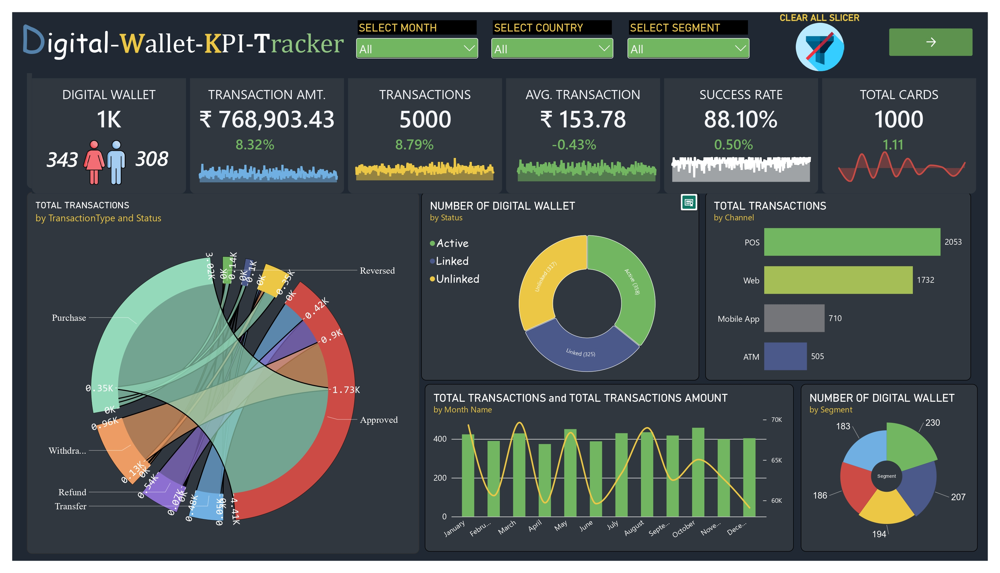
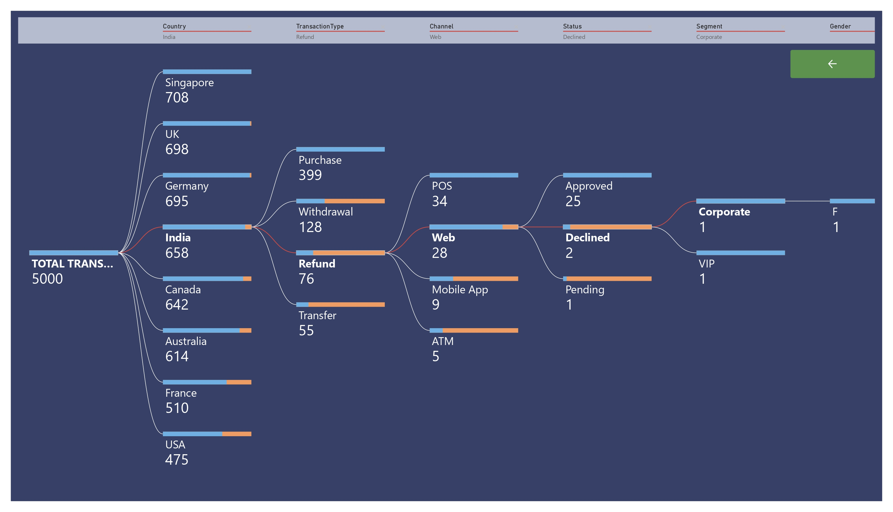

# Digital-Wallet-KPI-Tracker

A small data analytics project based on a payment and card-processing migration scenario.

The project covers:
- Data cleaning using Python and Pandas
- SQL data-quality checks
- Source-to-target migration reconciliation
- Transaction and customer analysis
- Power BI reporting and DAX

##  KPI Analysis

The KPI queries are kept in `03_kpi_summaries.sql`.

Main KPIs:

| KPI | Description |
|---|---|
| Total Customers | Number of unique customers |
| Total Cards | Number of cards |
| Total Transactions | Total transaction count |
| Transaction Value | Total transaction amount |
| Average Transaction | Average transaction amount |
| Successful Transactions | Count of successful transactions |
| Failed Transactions | Count of failed transactions |
| Pending Transactions | Count of pending transactions |
| Success Rate | Percentage of successful transactions |

## Skills Used

### SQL

- Joins
- CTEs
- Subqueries
- Aggregations
- GROUP BY
- HAVING
- CASE
- Window functions
- Data reconciliation
- Data-quality checks

### Python

- Pandas
- NumPy
- CSV processing
- Data cleaning
- Missing-value checks
- Duplicate checks
- Data-type conversion
- Data validation

### Power BI

- Data modeling
- Power Query
- DAX
- KPI measures
- Dashboard creation
- Filters and slicers
- Business reporting

### Analytics

- Data quality
- Migration validation
- Reconciliation
- Transaction analysis
- Customer analysis
- KPI reporting

## Dashboard Preview

## Dashboard Pge01

## Dashboard Page02

## Possible Improvements

Some future additions could be:
- Automated data-quality reports
- More reconciliation checks
- Incremental data validation
- Automated SQL tests
- Python reconciliation reports
- Customer segmentation
- Transaction anomaly checks
- Power BI drill-through pages
- Row-level security
- Automatic dashboard refresh

## Author

**Dinesh Kumar Behera**

Data Analyst

Skills:
`SQL` • `Python` • `Pandas` • `Power BI` • `DAX` • `Excel` • `Data Quality` • `Data Reconciliation`

